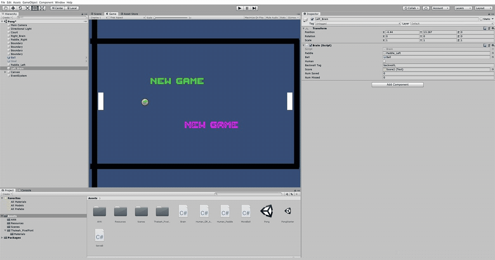

# Artificial-Neural-Net-for-Pong-Game-with-Non-Player-Character (NPC)

This is an example in Unity 2018.4.11f1 that uses an Artificial Neural Network that learns to play pong.  Both paddles of the network can be either manually operated with the computer’s keyboard.  Alternatively, either or both paddles can be set to use the neural network described below to learn to play against each other.
Because the game is in 2D and the physics of the ball can be calculated analytically very easily, and the paddles movements are limited to the vertical direction, the network(s) can be trained very quickly.  The network's learning rate that worked well was 0.05. 
To develop this network, there are several time challenging items among other things that need to be considered:
-	What activation functions work well with the network?
-	How many hidden layers to use?
-	What learning rate works well?
-	What initial force to give to the ball?
-	What is a good model for the bounce physics of the ball?
-	How to label the layers of the various surfaces so these can be identified and used in the Brain.cs program and with the various Unity assets?
-	What speed to give to the paddle?
-	What should be the output parameter that makes the paddle(s) move and places these at the correct location to hit the ball?
The neural network was constructed using C# as part of the students’ challenge assignment in a deep learning course using Unity taught by Dr. Penny de Bly.
The source folder contains the main C# scripts needed to develop this game.  The additional resources are part of the course and are not available.  However, the canvas items, fonts, sound effects, and bounce physics model can be easily created and/or downloaded from the Unity Assets Store.

The network consists of six inputs:
1. Ball (horizontal) x-velocity
2. Ball (vertical) y-velocity
3. Ball (horizontal ) x-position
4. Ball (vertical) y-position
5. Paddle (horizontal) x-position
6. Paddle (vertical) y-position
One output:
1. Paddle (vertical) y-velocity
The final design of the network has one hidden layer and uses the TanH activation function in the hidden and output layers. Below is a simple video demo.

#### Demo Video

#### References

(de Byl, Penny 2019)
de Byl, Penny. 2019, 'A Beginner's Guide To Machine Learning with Unity' Udemy Online Course, December 2019 <https://www.udemy.com/user/holistic3d>.
